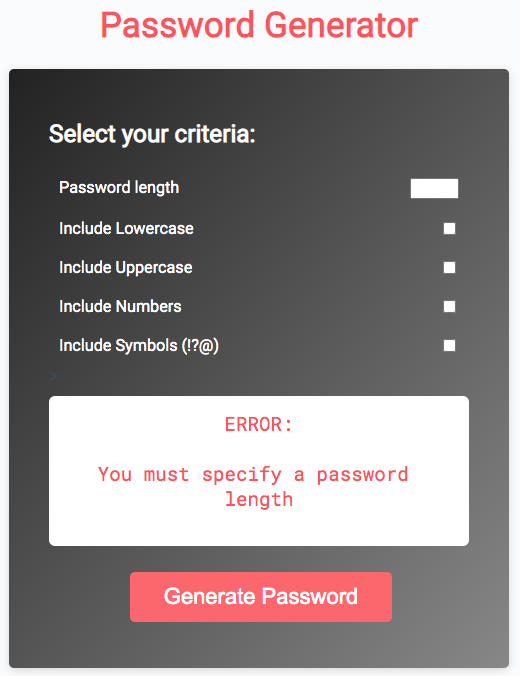
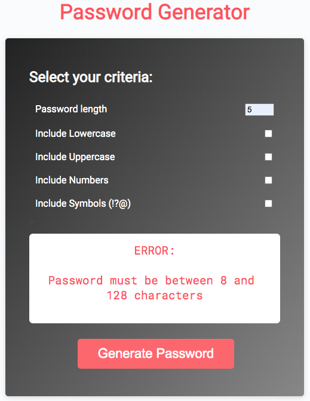
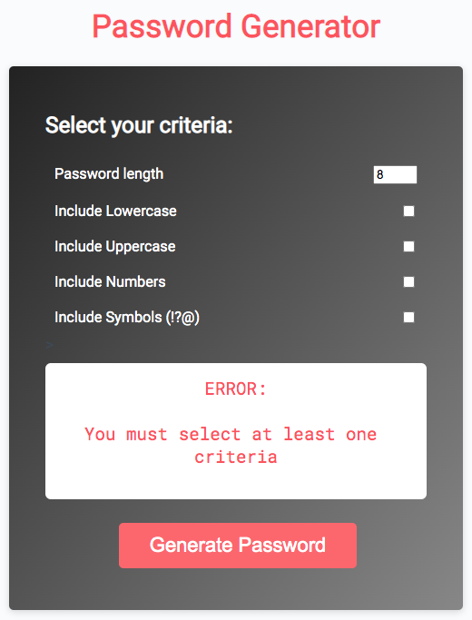
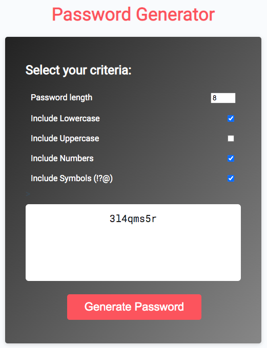

# Password-Generator

[Password Generator - Deployed](https://jungjungie.github.io/Password-Generator/)
 
[My GitHub](https://github.com/jungjungie)
 
[My Portfolio](https://jungjungie.github.io/)
 
 

## Project Description:

For this exercise, I was tasked with getting the password generator application to function based on user-specified criteria. I was provided with starter HTML & CSS files that gave the initial content, and an initial JS was also provided, but the page was not interactive, and the "Generate Password" button returned no results. 

I created a form that would capture the length and criteria for a better user experience. 

With JS, I coded out the following:
- Error message when no length is specified.
- Error message when no criteria selected.
- Error message if length specified is not between 8-128 characters. 
- Generate random password based on criteria chosen.

***
## Screenshots:
 
 

**Original Demo:**

 

**Working Demo:** Error Message when no length specified:

 

**Working Demo:** Error Message when length not between 8 and 128 characters:

 

**Working Demo:** Error Message when no criteria checked off:

 

**Working Demo:** With password generated:
 
