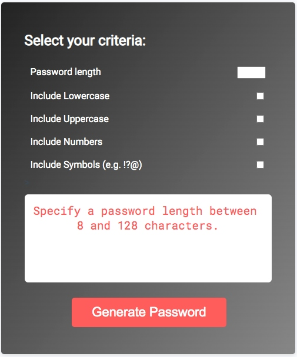

# Password-Generator

## Table of Contents
* [Description](#Description)
* [Usage](#Usage)
* [Demo](#Demo)
* [Contact](#Contact)

***
## Description:

An application that generates a random password based on specified criteria and password length. This app runs off of HTML, CSS and JavaScript.

Starter HTML and CSS files were provided, in addition to an initial JavaScript file. However, the page was not interactive and the "Generate Password" button returned no results. Refer to the **starter-code** folder to view starter files.

**Deployed Link:** https://jungjungie.github.io/Password-Generator/

***
## Usage:

- From the deployed link, input the password length and select password criteria before clicking "Generate Password".

  

- The following error message will display if no length is specified.

  

- The following error message will display if a length is specified but is not between 8 and 128 characters.

  

- The following error message will display if a valid password length is specified but no character types are selected.

  

***
## Demo:

  

***
## Contact:
- **GitHub:** https://github.com/jungjungie
- **Portfolio:** https://jungjungie.github.io/